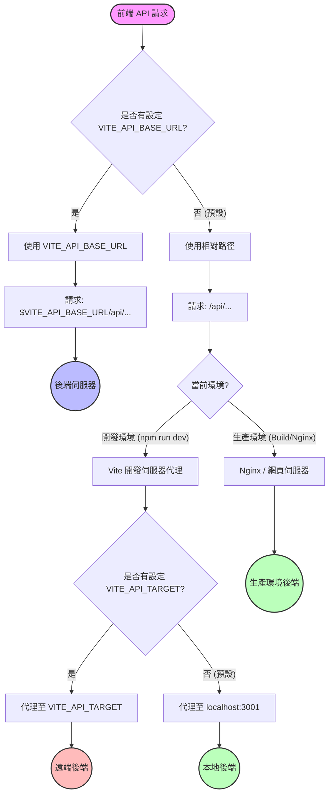

# API 路由邏輯與流程圖

本文件說明前端如何在不同環境（開發與生產）連接後端，以及如何透過 `.env` 變數進行設定。

## 🔄 流程圖 (Flowchart)

## 📝 設定情境說明

### 1. 本地開發 (標準模式)
*   **目標**：前端 (localhost:5173) 連接至 **本地後端** (localhost:3001)。
*   **設定方式** (`.env`)：
    *   `VITE_API_BASE_URL`: (留空 / 不設定)
    *   `VITE_API_TARGET`: (留空 / 不設定)
*   **請求流程**：前端 -> `/api` -> Vite Proxy -> `http://localhost:3001`

### 2. 本地前端 + 遠端後端 (除錯用)
*   **目標**：前端 (localhost:5173) 連接至 **已部署的遠端後端** (例如 krownsh.work)。
*   **設定方式** (`.env` 或 `.env.local`)：
    *   `VITE_API_TARGET=https://mediacrawl.krownsh.work`
*   **請求流程**：前端 -> `/api` -> Vite Proxy -> `https://mediacrawl.krownsh.work`

### 3. 生產環境部署
*   **目標**：已部署的前端連接至 **同網域下的後端**。
*   **設定方式**：
    *   `VITE_API_BASE_URL`: (留空 / 不設定)
*   **請求流程**：前端 -> `/api` -> Nginx/伺服器 -> 後端程序

### 4. 強制直接連線 (不建議，易有 CORS 問題)
*   **目標**：完全繞過 Proxy，直接請求特定網址 (瀏覽器直接發送請求)。
*   **設定方式**：
    *   `VITE_API_BASE_URL=http://localhost:3001`
*   **請求流程**：前端 -> `http://localhost:3001/api` (瀏覽器直接處理)
