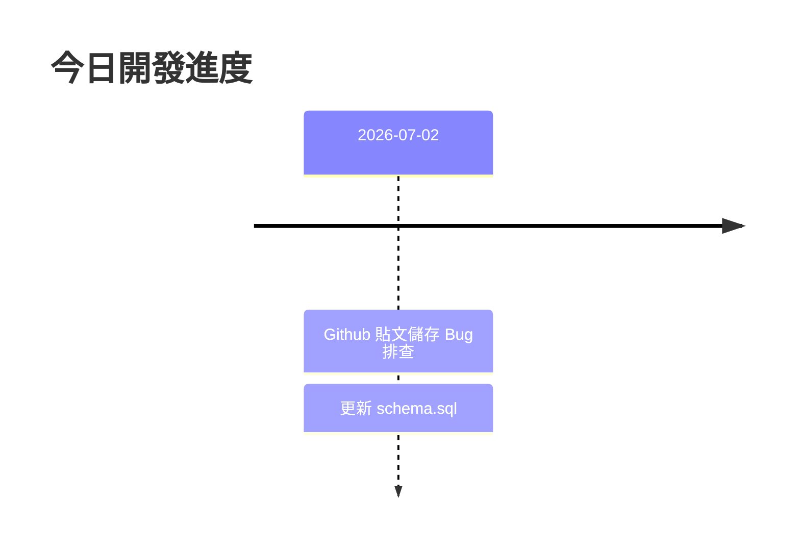

# 2026-07-02 開發日誌

## 任務：修正 Github 連結刷新後消失的問題

### 詳細操作
- 確認前端使用 optimistic update 將貼文立刻渲染於畫面中。
- 確認後端 `/api/process` 與 Supabase 之間的寫入流程。
- 發現 `collection_posts` 表格的 `platform` 欄位存在 `CHECK` 約束，未包含 `'github'`。這導致 `orchestrator.js` 寫入失敗，但因為不強制回傳 HTTP error，前端仍接收了抓取的資料。
- 更新了 `schema.sql`，將 `'github'` 加入 `platform IN (...)` 中。
- 提供了可直接在 Supabase SQL 執行區塊執行的指令，讓使用者自行去調整現存的資料庫。

### 目前狀態
- **已修正 `schema.sql`**
- **等待使用者至 Supabase 控制台執行 SQL 更新資料庫**

