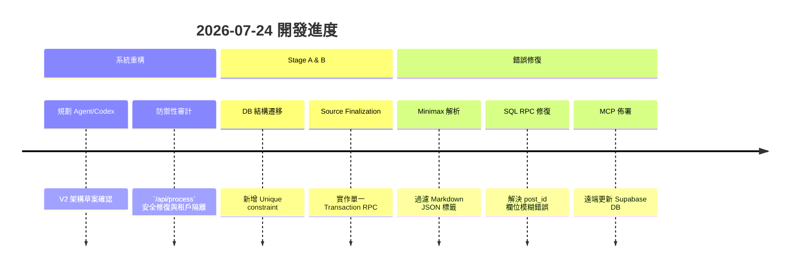

# 2026-07-24 規劃日誌

## 任務：將收藏系統升級為 Agent/Codex 驅動的實際應用系統

### 使用者確認的核心目標

- 收藏內容大概率是要實際應用的 Skill、套件、GitHub 專案、方法或工作流。
- 系統必須替收藏匹配既有／過往專案，主動找出應用位置並建立 POC／測試。
- Project Auditor 必須定時掃描允許的完整專案，主動建立需求、缺口與改善台帳。
- 安全、隔離、可逆的研究與 POC 應自動執行；正式修改、production、付費與對外操作才要求批准。
- 內容可走即時改寫／轉譯快車道，也可由研究、POC、整合或失敗經驗產生。
- 所有來源、應用案件、實驗、內容與人工筆記要可搜尋並互相追溯。

### 詳細操作

- 將 `docs/knowledge_action_vault_master_plan.md` 更新為 Agent/Codex Master Plan V2。
- 保留 2026-07-19 V1 作歷史附錄，明確標示衝突時以 V2 為準。
- 新增明日接手入口、已確認決策、未確認事項與下一個討論點。
- 設計多路 Route Agent：`quick_rewrite`、`translate_localize`、`research_content`、`apply_poc`。
- 設計 Project Auditor、Project Map、Project Needs Ledger、Opportunity Matcher、Application Case 與 POC Engine。
- 將 Codex 定位為 Local Agent Runner，規劃 Agent Job、lease、heartbeat、intent capsule、執行權限與 artifacts。
- 規劃互動式 Codex、排程 CLI 與 thin runner 三種待確認啟動方式。
- 更新 `docs/process_crawler_pipeline.md`，記錄舊流程、V2 Agent 下游流程、Source Finalization、Route Agent 與 Codex 接點。
- 記錄 `/api/process` 靜態檢查發現的 P0 驗證、tenant、partial write、失效模型與 JSON validation 風險。
- 將本輪使用者提問與解答追加至 `docs/project/questions.md`。

### 未執行

- 未修改程式碼、Supabase schema、n8n 或 Mac Vault。
- 未建立 Codex skill／plugin／排程 Runner。
- 未執行任何 POC、套件安裝、資料庫寫入或外部發布。
- 未修改 `docs/project/tasks.md`。
- 未 Commit 或 Push。

### 目前狀態

- 產品目標與核心流程：已確認。
- Agent/Codex 系統架構草案：已寫入文件。
- MVP 分期與驗收標準：待下一次討論。
- 第一批 allowlisted 專案：未確認。
- Codex Runner 啟動方式：未確認。

### 明日直接接手

1. 讀取 `docs/knowledge_action_vault_master_plan.md` 的「0. 明日接手入口」。
2. 排定 MVP Phase 與每階段驗收條件。
3. 確認第一批 Project Auditor allowlist。
4. 確認 Codex Runner 的 Windows／Mac 啟動策略。

---

## Stage A 實作接續

### 已完成（尚未部署遠端 DB）

- 使用者同意先實作 Stage A，並指定完全移除 Gemini。
- `/api/process` 改為 `requireApiAuth` 保護；瀏覽器以 Supabase Bearer JWT 決定 `user_id`，n8n API key 必須以 `MEDIA_API_KEY_USER_ID` 映射固定使用者，body `userId` 已移除。
- `GET /api/posts`、annotations、stats 同樣改以 authenticated user scope 查詢／寫入。
- `collection_posts` upsert 與手動 fallback 改用 `(user_id, original_url)`；`database/deployments/add_unique_constraint.sql` 改為可替換 legacy global URL constraint 的 SQL。
- analysis、media、comments 寫入失敗不再吞掉錯誤並回成功，並會嘗試還原該表舊資料；回應附帶 `x-correlation-id`。
- 移除 `@google/genai`、Google/Gemini fallback、前端 Gemini 模型選單、模型列舉腳本與資料檔；AI analysis 現為 MiniMax-only，拒絕非完整 JSON object，且不寫 mock 成功結果。
- 新增／更新安全、tenant 契約、AI provider regression tests，皆已通過。

### 未完成／需在部署前處理

- 目前沒有可用 Supabase CLI／migration scaffold；未直接變更遠端 Supabase。需先在 staging／備份後套用 `database/deployments/add_unique_constraint.sql` 並檢查 existing constraint、資料完整性與重跑行為。
- Stage A 的 child-row replace 已改為顯性失敗，但跨表 transaction、source finalization 與 outbox 仍待 Stage B。
- `npm run build` 在目前 Node `18.19.1` 失敗：專案 Vite 需要 Node `20.19+` 或 `22.12+`，且本機缺少 `@rollup/rollup-linux-x64-gnu` optional dependency。
- `npm run lint` 仍有 64 個既有錯誤（含 temp crawler 檔 parsing error）；本次 touched code 的 AI service 亦有既有 CRLF lint 項目，未擴大範圍做全專案 lint cleanup。

### 下一個工作

1. 完成 Stage A DB rollout 與資料污染 audit。
2. 建立 Stage B source finalization、event outbox 與 idempotency integration tests。
3. 對本 repo 啟動第一個 read-only Project Auditor dry-run。

### n8n Capture 設定補充

- 新增 `docs/n8n_capture_setup.md`，記錄 n8n Header Auth credential、`MEDIA_API_KEY`／`MEDIA_API_KEY_USER_ID` 後端設定、HTTP Request body、correlation id 與 200／202／401／503／500 驗收矩陣。
## Project Auditor dry-run

- 建立 `docs/project_audit_media_platform_2026-07-24.md`，記錄 API 存取控制、tenant isolation、SSRF、密鑰與建置環境風險。
- P0 優先項目為公開發布 API、圖片工作流、批次分類與可計費 AI endpoints；在擴大 crawler / Agent 前先收斂。
- 未讀取 `.env`、未套用任何資料庫 migration、未發送任何社群發布請求。
- `server/env.template` 的追蹤憑證已改為 placeholder；部署端的既有 Supabase 憑證必須輪替（本地未執行遠端輪替）。

### 審計修復（本機完成，未部署）

- capture API key 現僅能呼叫 `/api/process`；posts、stats、AI、publish、batch classify 與 image workflow 路由只接受 Supabase JWT。
- batch classify 限定 authenticated user 的資料；公開 image proxy 加入 HTTPS、公網 DNS、拒絕 redirect／非 image MIME、10MB 與 10 秒限制。
- Gemini 相關 image generation／image workflow 已退役為 authenticated HTTP 410；前端頁面改為明確停用畫面。
- X crawler 不再 log guest token，改由 `TWITTER_PUBLIC_BEARER_TOKEN` 讀取；追蹤 template 與 crawler reference 的固定憑證均改為 placeholder。
- 本次 4 個 Node security/contract tests 及涉及檔案 lint 均通過；全專案 build 仍受 Node 18／Rollup optional dependency 的既有環境問題阻擋。

### Stage B source finalization（本機完成，待 staging）

- 新增 `database/deployments/stage_b_source_finalization.sql`：RPC 以單一 transaction upsert post、replace analysis/media/comments，並建立以 user + correlation id 去重的 `source.ingested.v1` outbox event。
- `/api/process` 改為 crawler 完成與 AI 嘗試後才呼叫 RPC；分類／AI 失敗會記錄真實 error，但不阻止來源 finalization。
- 新增 Stage B contract test 與部署／驗收說明；目前沒有 Supabase CLI、`psql` 或已授權 MCP，未對 staging／production 執行 SQL。

### 使用者回報的部署狀態（待本機外部驗證）

- 使用者已回報 `database/deployments/add_unique_constraint.sql` 與 `database/deployments/stage_b_source_finalization.sql` 均已執行。
- 尚待依 `docs/stage_b_source_finalization_deployment.md` 確認 `source_domains` 型別、RPC grant、outbox 寫入與相同 correlation id 的 idempotency。

## AI 與 DB 錯誤修復 (Minimax & Supabase)

- **AI 解析錯誤修復**：修復了 `aiService.js` 中 `parseAiResponse` 未能處理 Minimax 返回 Markdown ````json ```` 標籤的問題，現在會自動過濾前後標籤。
- **DB RPC 錯誤修復**：修復了 `database/deployments/stage_b_source_finalization.sql` 中 `delete` 語句裡 `post_id` 欄位模糊衝突的問題（新增了 `cpa`, `cpm`, `cpc` table aliases）。
- **MCP SQL 佈署**：透過 `supabase-mcp-server` MCP 工具，成功將更新後的 `finalize_collection_capture` 函數佈署至 Supabase 資料庫。
- **重啟服務**：透過 `pm2 restart media-collection-server --update-env` 重啟了爬蟲 API 伺服器，使更新生效。


