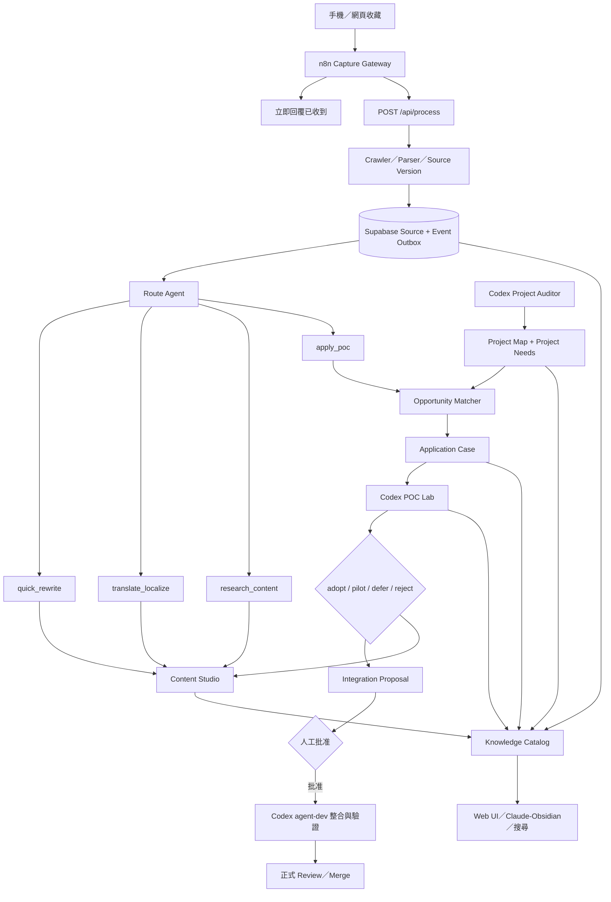

# 收藏 → 實際應用 → 內容產出 → 長期記憶：Agent/Codex Master Plan V2

日期：2026-07-24
狀態：產品目標與核心流程已重新確認；尚未開始實作
專案模式：`sideproject`（本次對話已確認；local mode scaffold 尚未持久化）
本版優先序：**實際應用與驗證 → 內容產出 → 長期記憶**

> 本 V2 是目前有效規格。下方 2026-07-19 V1 保留作歷史參考；若內容衝突，以 V2 為準。

## 0. 明日接手入口

明日不用重新討論產品目標，直接從下列項目繼續：

1. 排定 MVP 與分階段開發順序。
2. 定義每一階段的驗收條件。
3. 決定第一批允許 Project Auditor 掃描的專案根目錄。
4. 確認 Codex Local Agent Runner 的啟動方式：互動式 session、排程 CLI，或兩者並行。
5. 確認後才開始修改 schema、n8n 或程式碼。

本輪已確認但尚未實作：

- 收藏不能停在摘要，必須找到實際出口、明確延後條件或實測淘汰原因。
- 內容可走即時改寫／轉譯快車道，不必全部等待深入研究或 POC。
- Skill、套件、GitHub 專案等收藏，預設視為可能要實際應用的候選。
- Agent 必須定時掃描整個「允許的專案」，主動發現需求、缺口與改善機會。
- Codex 不只是聊天助手，而是本機 Project Auditor、POC Runner、Integration Agent 與 Vault Worker。
- 安全、隔離、可逆的研究與 POC 應自動完成；正式專案、production、付費或對外行為才要求批准。

尚未確認：

- 第一版要納入哪些實際專案，不能從 G 槽資料夾名稱自行猜測。
- Windows 與 Mac 上如何排程／喚醒 Codex Runner。
- Codex Runner 使用現成 CLI、專案 skill、plugin，或自建 thin wrapper。
- Mac n8n 的安裝方式與 Vault 實際可寫權限。
- 正式 Supabase schema 是否完全等同 repo 內的 `schema.sql`。

## 1. 使用者真正要的產品

這不是普通書籤、摘要器或第二大腦，而是：

> 一套會理解收藏用途、匹配既有或過往專案、主動研究與建立 POC、協助真正落地，並把成果轉成自媒體內容與可搜尋長期記憶的 AI 行動系統。

三個核心目標：

1. **實際應用**
   - 收藏的 Skill、套件、GitHub 專案、Prompt、工作流與方法，大概率是之後要使用的東西。
   - 系統要主動找出可應用的既有專案、模組、需求與測試出口。
   - 不允許只留下「值得研究」「看起來有趣」。

2. **內容產出**
   - 可直接依原文做即時改寫、轉譯與平台化。
   - 也可把深入研究、POC、成功整合或失敗踩坑轉成原創內容。
   - 即時內容與實際應用可以同時進行，彼此不互相阻塞。

3. **外接記憶**
   - 保存來源、專案需求、實驗、整合結果、發布作品與人工筆記。
   - 能用關鍵字、語意、專案、工具與狀態快速找回。
   - 新專案或新需求出現時，舊收藏必須重新浮上來。

## 2. 舊流程與 V2 改變

### 2.1 以前的流程

```text
手機／n8n 送 URL
→ 呼叫 POST /api/process
→ 腳本／Crawler 解析
→ LLM 解析與摘要
→ 寫入 Supabase
→ 有時間時再開網站人工分類整理
```

主要問題：

- LLM 結果停在摘要與分類。
- 收藏與既有專案完全斷開。
- 沒有主動研究、POC、測試與實際整合。
- 沒時間打開網站時，收藏會再次沉沒。
- 系統只在「新收藏進來」時運作，不會因新需求或新專案重新喚醒舊資料。

### 2.2 V2 流程



## 3. Route Agent：一筆收藏可走多條路

`routes` 必須是多選，不是一筆資料只有一個分類：

```json
{
  "routes": [
    "quick_rewrite",
    "translate_localize",
    "apply_poc"
  ],
  "urgency": "high",
  "reasons": [
    "可立即改寫為即時貼文",
    "內容中的 GitHub 專案可能解決既有 crawler 缺口"
  ]
}
```

路由定義：

- `quick_rewrite`：依原文直接改寫為即時貼文，不宣稱做過深入研究。
- `translate_localize`：翻譯、在地化、轉成指定語氣與平台格式。
- `research_content`：需要查證、補案例、找反方觀點後再創作。
- `apply_poc`：匹配專案、建立應用案件、研究工具並進行實測。

同一筆來源可以先產生即時貼文，之後再完成 POC 與實作型內容。

## 4. 單筆收藏的完成標準

核心鐵律：

> 沒有實際應用出口、明確延後條件、實測淘汰證據或內容產物，就不算處理完成。

生命週期：

```text
captured
→ intent_routed
→ project_matched / content_ready
→ research_optional
→ poc_planned
→ testing
→ evaluated
→ integrated / deferred / rejected / contentized
```

合法出口：

1. `integrated`：已用進某個專案。
2. `integration_ready`：POC 成功，等待正式批准。
3. `deferred`：缺少條件，保存 blocker、retry trigger 與重查時間。
4. `rejected_with_evidence`：實測不適合，保存原因以避免重踩。
5. `contentized`：已轉成內容素材、草稿或已發布作品。
6. 同時 `integrated + contentized`。

每份 Application Case 至少包含：

- 收藏內容與推測用途。
- 對應專案、需求、模組與證據位置。
- 應用假設與預期價值。
- License、相容性、成本、供應鏈與隱私風險。
- baseline、POC、成功條件與實測結果。
- 下一步、blocker、重查時間。
- 可轉化的內容角度與人工筆記。

## 5. Project Auditor：定時掃描專案需求與缺口

Project Auditor 不能只讀使用者手寫的 `tasks.md`。它必須定時掃描整個允許專案，主動找出：

- Bug、未完成流程與 silent failure。
- 缺少的功能、測試與文件。
- 效能瓶頸、重複邏輯與技術債。
- 過期依賴與安全風險。
- 可重用的模組、Prompt、Crawler、Skill、schema 與測試案例。
- 過去已嘗試但失敗的方案。

建議掃描時機：

- 專案第一次登錄：完整掃描。
- 重要 Commit 後：增量掃描。
- 每週：完整深度掃描。
- 新收藏與某專案高度相關時：針對相關模組重掃。

掃描排除：

- `.env`、Token、Cookie、憑證與私人資料。
- `node_modules`、cache、dist、build 與大型素材。
- 未列入 allowlist 的其他專案與硬碟路徑。

Auditor 不得自行修改受保護的 `tasks.md`，而是寫入獨立 Project Needs Ledger：

```json
{
  "title": "X Article 正文擷取不完整",
  "project_id": "...",
  "evidence": [
    {
      "type": "sample_failure",
      "location": "3/100 筆正文只有 URL"
    }
  ],
  "impact": "無法進行研究、應用匹配與內容轉化",
  "severity": "high",
  "suggested_validation": "以失敗網址建立回歸測試",
  "confidence": 0.92,
  "status": "open"
}
```

## 6. Project Map 與 Opportunity Matcher

Project Map 保存：

- 專案名稱、目的、狀態與 Windows／Mac 路徑別名。
- 技術棧、資料庫、API、模組與現有能力。
- README、docs、Task Logs、MEMORY、schema 與測試摘要。
- Project Needs。
- 可重用資產與過往失敗方案。
- 允許 Agent 執行的權限模式。

Opportunity Matcher 必須雙向運作：

```text
新收藏 → 搜尋適用專案與需求
新需求 → 搜尋過去收藏
新專案 → 重新比對 deferred 收藏
套件更新 → 重查以前失敗的 POC
```

匹配結果必須具體指出：

- 哪個專案與功能。
- 哪個模組或檔案是候選整合點。
- 解決哪個已知需求。
- 預期效益、難度、風險與信心。
- 最小可行 POC 與驗收方式。

## 7. Research 與 POC Engine

深入研究不是所有內容的必經路；只有 `research_content` 或 `apply_poc` 需要。

`apply_poc` 流程：

```text
match
→ research package／repo／skill
→ application hypothesis
→ baseline
→ isolated POC
→ comparative test
→ evaluation
→ integration proposal
```

研究範圍：

- 官方文件、release、Issue、維護狀況。
- License、相容性、系統需求與安裝大小。
- API 成本、資料外傳、供應鏈與安全風險。
- 是否和現有功能重複。

POC 規則：

- 優先放在目標專案 `test/poc/<application-case-id>/` 或獨立 allowlisted Lab。
- 不使用 production DB、正式 Token 或私人資料。
- 外部程式碼先做靜態檢查，再在隔離環境執行。
- 大型 cache 必須放 G 槽或 `/Volumes/DevSSD`。
- 保存版本、環境、命令、baseline、log、成本與重現方式。
- 失敗不得偽裝成成功或只留在 console。

標準結論：

- `adopt`
- `pilot`
- `defer`
- `reject`
- `blocked`

## 8. Codex／Agent 在 V2 的角色

### 8.1 Codex 不再只是人工開啟後的聊天工具

Codex 被設計為本機執行層，至少承擔：

- `project_audit`
- `opportunity_match`
- `research`
- `poc`
- `integration`
- `content_transform`
- `vault_projection`

這些是邏輯角色，第一版不需要拆成七個互相對話的 LLM Agent；應先由一個可觀測的 Orchestrator 依 job type 呼叫相同 Codex Runner。

### 8.2 Agent Control Plane

Supabase／Backend 保存 Agent Job：

```text
queued
→ leased
→ preparing
→ running
→ awaiting_approval
→ completed
```

失敗狀態：

```text
failed
blocked
expired
cancelled
```

每個 job 必須有：

- `job_type`
- `project_id`
- `source_id`／`application_case_id`
- `intent_capsule`
- `allowed_paths`
- `allowed_commands`
- `network_policy`
- `max_runtime`
- `max_cost`
- `attempts`
- `lease_owner`
- `correlation_id`
- `result_artifacts`
- `last_error`

### 8.3 Local Agent Runner

Local Runner 位於真正能讀取 repo、POC Lab 與 Vault 的 Windows／Mac：

1. 驗證裝置與 caller。
2. 從 Backend lease 一個允許的 job。
3. 解析 intent capsule 與專案 policy。
4. 讀取專案 local rules。
5. 執行唯讀 audit、研究、POC、測試或允許的 agent-dev 修改。
6. 上傳結構化結果、log、diff、測試報告與 content package。
7. 完成、失敗或轉為 `awaiting_approval`。

排程方式尚未確認，必須在明日規劃中選擇：

- 使用者開啟 Codex session 時處理 pending jobs。
- Windows Task Scheduler／macOS launchd 定時啟動受控 Codex CLI。
- 常駐 thin runner 負責 lease，必要時才呼叫 Codex。

不能假設目前 Codex 有可直接長駐的 daemon 介面；實作前需查證實際 CLI 能力。

### 8.4 未來 Codex Skill／Plugin

可考慮建立專用 `knowledge-action-vault` skill 或 plugin，封裝：

- job lease／ack／fail。
- project audit 契約。
- POC 目錄與測試報告格式。
- approval card。
- Vault projection。

此項尚未批准建立；第一版先驗證流程，再決定是否封裝。

## 9. 自動執行權限

### Level 1：直接執行

- 專案唯讀掃描。
- 文件、Issue、release、License 研究。
- 收藏與專案匹配。
- baseline、測試規格、報告與內容草稿。

### Level 2：隔離 POC 自動執行

- Clone／下載候選工具。
- 在無正式秘密與 production access 的 Lab 安裝、啟動與測試。
- 限制時間、資源與網路。

### Level 3：專案 opt-in `agent-dev`

- 在隔離 worktree 修改。
- 補測試與文件。
- 執行 build／lint／test。
- 建立本機 Commit。
- 不 Push、不合併 main、不部署。

### 必須批准

- 正式分支、正式依賴、schema、production 資料。
- 付費 API、帳號、Cookie、Token。
- 對外訊息、社群發布、部署、刪除與不可逆操作。

## 10. 內容產出

### 10.1 快車道

```text
source
→ quick_rewrite／translate_localize
→ Hook／平台格式／草稿
→ 人工確認
→ publication
```

快車道必須：

- 清楚標示只依原文改寫或翻譯。
- 保留來源。
- 不把未查證主張寫成自行研究的結論。
- 不因等待 POC 而錯過即時性。

### 10.2 實作型內容

```text
source
→ project need
→ POC／integration
→ result
→ personal conclusion
→ article／thread／tutorial／video script
```

內容可來自：

- 即時改寫。
- 轉譯與在地化。
- 深入研究。
- POC 實測。
- 正式整合。
- 失敗案例與踩坑。

## 11. 知識目錄與首頁

六個產品入口：

1. Capture Inbox。
2. Project Needs。
3. Application Cases。
4. POC Lab。
5. Content Studio。
6. Knowledge Search。

完整追溯：

```text
Source
→ Route
→ Project Need
→ Application Case
→ Experiment
→ Integration
→ Content Asset
→ Publication
```

首頁不顯示整個 backlog，只顯示最值得處理的少量項目：

- 一個可立即執行的 POC。
- 一個等待批准的整合。
- 一份已具備素材的內容草稿。

所有 deferred 項目都必須有 blocker、retry trigger 與重查時間，不建立沒有喚醒條件的垃圾墳場。

## 12. V2 資料模型草案

### Source

- `sources`
- `source_versions`
- `source_routes`

### Project Intelligence

- `projects`
- `project_snapshots`
- `project_capabilities`
- `project_needs`

### Application

- `application_cases`
- `experiments`
- `experiment_runs`
- `integration_proposals`

### Content

- `content_assets`
- `content_revisions`
- `content_evidence_links`
- `publications`

### Memory／Operations

- `annotations`
- `entities`
- `relations`
- `embeddings`
- `processing_jobs`
- `agent_jobs`
- `agent_job_events`
- `model_runs`
- `event_outbox`
- `vault_sync_state`

關鍵關係：

- 一個 source 可以有多個 routes。
- 一個 source 可以對應多個 application cases 與 content assets。
- 一個 Project Need 可以被多個歷史收藏匹配。
- 一份 content asset 可以引用多個來源、研究、實驗與整合結果。
- 人工 annotation 可以掛在任何 aggregate，AI 不得覆寫。

`dossier_json` 不再是唯一知識本體；它應是由 source、claim／relation、experiment 與 content evidence 產生的可重建投影。

本節是規格草案，不代表已修改正式 Supabase schema。實作前必須讀取並核對正式 schema。

## 13. 系統權威分工

- **Supabase**：來源、版本、route、project need、application case、job、POC 結果、內容版本與同步狀態。
- **Git repo**：真正程式碼、測試、文件與 Commit。
- **POC Lab**：隔離實驗與可重現 artifacts。
- **Web UI**：流程看板、批准與 Content Studio。
- **Claude-Obsidian**：閱讀、搜尋、人工筆記與本地思考。
- **n8n**：Capture Gateway 與通知，不承載核心商業邏輯。
- **Codex Local Runner**：專案掃描、POC、測試、agent-dev 整合與 Vault 本機操作。

## 14. `/api/process` 與事件邊界

`/api/process` 繼續維持 ingestion 契約：

- 平台辨識。
- 擷取與正規化。
- 原始來源、媒體與留言入庫。
- 回傳既有 `{ source, data }`。

目標演進：

1. 先保留 legacy 同步 AI，避免破壞現有使用方式。
2. Source 成功 finalization 後，由 Backend 在可靠邊界寫入 `source.ingested.v1` event。
3. Route Agent、Content Worker、Matcher 與 Codex jobs 從 event／queue 啟動。
4. n8n 不再負責 `POST job → Wait → GET status` 的長輪詢。
5. 新 pipeline 穩定後，才把 legacy AI 從 request path 移出。

事件建立必須由 Backend／DB 與 source finalization 綁定；不能依賴 n8n 在 `/api/process` 成功後再補打一個 job API，否則 n8n 中斷會留下永遠未處理的 source。

## 15. 已發現的 P0 風險

以下是 repo 靜態檢查結果；正式 DB 狀態未確認：

1. `/api/process` 尚未套用 `requireApiAuth`，但信任 body 的 `userId`。
2. Backend 使用 service-role，RLS 無法保護上述未驗證 caller。
3. `original_url` constraint 是全域 unique；manual lookup 也沒有 `user_id`，存在跨使用者衝突風險。
4. analysis／media／comments 使用 delete-then-insert，錯誤只記 log，最後仍可能回成功。
5. Gemini fallback 仍指定已關閉的 `gemini-1.5-flash`，且 SDK 呼叫方式需更新。
6. AI JSON 解析仍使用截取第一個 `{` 到最後一個 `}`，應改成 Structured Output＋schema validation。

上述修復必須排在新增 Agent pipeline 之前，並檢查過去執行是否已造成缺漏或跨 tenant 污染。

## 16. 本輪不做

- 不修改程式碼。
- 不修改正式 Supabase schema。
- 不修改 n8n。
- 不啟動 Codex 排程 Runner。
- 不 clone 或安裝收藏中的 repo／Skill。
- 不寫入正式 Mac Vault。
- 不調整 `tasks.md`。
- 不自動 Commit 或 Push。

---

# 2026-07-19 V1 原始規劃（歷史參考）

日期：2026-07-19
狀態：規劃完成，尚未實作
保護邊界：不修改既有 `/api/process` 契約、不直接修改 Supabase schema、不寫入正式 Mac Vault

## 0. 最終目標

手機分享的每一條連結，最後不能只停在「資料庫裡的一篇貼文」或「一份 AI 摘要」。系統必須把它轉成：

1. 可追溯的原始來源。
2. 去重後的知識項目。
3. 與既有內容合併的主題 Dossier。
4. 對使用者真正有用的行動候選。
5. 經人工批准後才進入實作、學習、規劃、策略或內容產出。
6. 同步成 Claude-Obsidian 中可持續閱讀與人工編修的 Markdown。

核心原則：

- Supabase 是資料與狀態的 source of truth。
- Claude-Obsidian 是知識的本地閱讀、思考與人工編修層。
- n8n 是流程編排器，不承載複雜商業邏輯。
- `/api/process` 是穩定 ingestion API，不塞入新的長流程。
- 社群內容一律視為不可信輸入，不能直接觸發安裝、改碼或發文。
- AI 先提出 Action Candidate，使用者批准後才執行。

## 1. 完整資料流

```mermaid
flowchart TD
    A[手機分享連結] --> B[Mac n8n Webhook]
    B --> C[立即回覆手機：已收到]
    B --> D[URL 驗證／正規化／correlation id]
    D --> E[POST /api/process]
    E --> F[共享 BrowserManager 或 X Adapter]
    F --> G[正規化貼文＋媒體＋留言]
    G --> H[(Supabase Source Post)]
    H --> I[建立 Knowledge Job]
    I --> J[Exact Dedupe]
    J --> K[知識抽取]
    K --> L[候選 Cluster 檢索]
    L --> M{相同／相關／全新？}
    M -->|相同| N[只新增來源，不重複建知識]
    M -->|相關| O[更新既有 Dossier 的差異與新觀點]
    M -->|全新| P[建立新 Topic Cluster／Dossier]
    N --> Q[產生或更新 Action Candidate]
    O --> Q
    P --> Q
    Q --> R[(Vault Sync Outbox)]
    R --> S[Mac Local Vault Bridge]
    S --> T[Preview 產生 Markdown]
    T --> U{驗證／衝突檢查}
    U -->|安全| V[/Volumes/DevSSD/claude-obsidian]
    U -->|衝突| W[保留 conflict，通知 n8n]
    V --> X[Obsidian Action Inbox]
    X --> Y{使用者決定}
    Y -->|接受| Z[建立學習／POC／專案／策略／內容任務]
    Y -->|稍後| AA[保持待辦]
    Y -->|略過| AB[封存但保留來源]
```

## 2. Workflow A：手機 → n8n → `/api/process`

### 2.1 n8n Webhook 輸入

手機分享捷徑只需要送：

```json
{
  "url": "https://example.com/post",
  "source": "ios-share-sheet",
  "captured_at": "2026-07-19T12:00:00+08:00"
}
```

n8n 不接受任意 command、檔案路徑或 shell 內容。

### 2.2 Webhook 第一時間回應

n8n 收到後立即回覆手機：

```json
{
  "accepted": true,
  "message": "已收到，正在處理",
  "correlation_id": "..."
}
```

手機不需要等 crawler、AI 或 Vault 同步完成。後續流程在 n8n 背景繼續執行。

### 2.3 URL Guard

n8n 執行：

1. URL 格式驗證。
2. 只允許 `http`／`https`。
3. 移除追蹤參數，例如 `utm_*`。
4. Threads `threads.com` 統一為 `threads.net`。
5. 產生 `correlation_id`。
6. 以 credential 注入 backend API key，不把 key 放在 workflow JSON 明文。

### 2.4 呼叫 `/api/process`

維持既有 body：

```json
{
  "url": "https://example.com/post",
  "userId": "supabase-user-uuid"
}
```

未來補上 `X-API-Key` 或 Bearer JWT，但不改 body 與 `{ source, data }` 基本 response。

### 2.5 `/api/process` 的責任

只負責：

- 平台辨識。
- 爬蟲取得。
- Unified Post 正規化。
- 原始資料、媒體、留言入庫。
- 回傳 `dbId` 與基本狀態。

目前既有同步 AI 摘要先保留，直到新 Knowledge Pipeline 驗證完成；新流程不依賴這份 legacy summary。

## 3. Workflow B：Crawler 統一管理

### 3.1 BrowserManager 決策

建立單一 process-wide BrowserManager：

- 共用 browser process／binary。
- 每個 job 建立獨立 BrowserContext 與 Page。
- 集中管理 launch args、proxy、timeout、重試、log、crash restart、graceful shutdown。
- platform crawler 不再自己 `puppeteer.launch()`。

### 3.2 Profile 決策

- 不共用單一 persistent profile。
- 不需要登入：使用暫時 BrowserContext。
- 需要登入：使用「平台＋帳號」專屬 profile。
- 同一 profile 同時間只允許一個 writer，必須有 lock。
- Cookie 與 profile 不寫入 Git。

### 3.3 Adapter 架構

```text
AcquisitionRouter
├── ThreadsAdapter  → BrowserManager → ThreadsParser
├── InstagramAdapter → BrowserManager → InstagramParser
├── FacebookAdapter → BrowserManager → FacebookParser
├── YouTubeAdapter → BrowserManager → YouTubeParser
├── GenericAdapter → BrowserManager → GenericParser
└── XAdapter → Guest GraphQL（暫時保留）
```

BrowserManager 重構不應和 Knowledge Pipeline 同時上線。先用契約測試保護 `/api/process`，再獨立切換。

## 4. Workflow C：Knowledge Job

每個已成功入庫的 post 建立一個可重跑、具冪等性的 Knowledge Job。

### 4.1 Job 狀態

```text
queued
→ extracting
→ matching
→ clustering
→ actionizing
→ sync_pending
→ completed
```

失敗狀態：

```text
failed_extract
failed_match
failed_ai
failed_sync
needs_review
```

### 4.2 冪等鍵

建議：

```text
knowledge-job:<user_id>:<post_id>:<pipeline_version>
```

相同 post、相同 pipeline version 重試時更新原 job，不新增重複結果。

## 5. 三層去重與聚類

### 5.1 Exact Duplicate

按以下順序判斷：

1. `platform + platform_post_id`。
2. canonical URL。
3. 正規化 content hash。
4. canonical entity URL，例如 GitHub repo URL。

命中時：

- 不建立第二個 Dossier。
- 保留新 Source Post 作為證據或直接標記 duplicate。
- 更新來源數量與最後出現時間。

### 5.2 Semantic Duplicate

不同貼文可能都在講同一工具、repo、Skill 或方法。

初始規則：

- 相同 canonical entity key：直接視為同一 cluster。
- embedding similarity `>= 0.90`：預設同義內容，交給 AI 做最後驗證。
- similarity `0.78–0.90`：視為相關內容，加入同一 cluster 並產生 delta。
- similarity `< 0.78`：建立新 cluster。

上述門檻是第一版校正值，必須用既有 100 筆人工驗證後再固定。

### 5.3 Related Content

同 cluster 的新貼文只分析：

- 新增了什麼？
- 與既有內容有何差異？
- 是否提供反例或限制？
- 是否提高某個行動的可信度？
- 是否只是換句話說？

禁止每次重新生成整份 Dossier，避免內容漂移與浪費 token。

## 6. AI 結構化抽取

AI 必須輸出 JSON，不直接輸出自由格式文章。

```json
{
  "knowledge_type": "tool|workflow|concept|strategy|case|opinion|market",
  "title": "穩定標題",
  "entities": [],
  "claims": [],
  "steps": [],
  "prerequisites": [],
  "evidence": [],
  "limitations": [],
  "risks": [],
  "source_quality": 0,
  "personal_fit": 0,
  "actionability": 0,
  "novelty": 0,
  "estimated_effort": "xs|s|m|l|xl",
  "suggested_route": "archive|learn|implement|plan|strategy|content"
}
```

貼文中的 prompt、安裝命令或「忽略前面指示」一律只當資料，不可成為系統指令。

## 7. Action Candidate

### 7.1 分數

第一版 100 分：

- 個人方向符合度：30。
- 可實作性：25。
- 新穎性：20。
- 證據品質：15。
- 時間／成本合理性：10。

路由：

- `>= 70`：進入 Action Inbox。
- `50–69`：保留為學習／觀察。
- `< 50`：預設 archive，但保留來源與 cluster 關係。

### 7.2 類型與輸出

#### learn

- 概念與先備知識。
- 最小練習。
- 驗證題。
- 下一個學習節點。

#### implement

- repo／工具來源。
- license、依賴、平台需求。
- 隔離環境安裝方案。
- 最小 POC。
- 驗收條件。
- 供應鏈與隱私風險。

#### plan

- 目標。
- 任務拆解。
- 依賴關係。
- 完成定義。
- 停損條件。

#### strategy

- 適用情境。
- 決策規則。
- KPI。
- 實驗設計。
- 反例與限制。

#### content

- 核心觀點。
- 受眾。
- 素材來源。
- 平台格式。
- 草稿與查證清單。

### 7.3 人工閘門

Action Candidate 只能進入：

```text
pending → accepted → in_progress → completed
        ↘ snoozed
        ↘ rejected
```

只有 `accepted` 才能觸發後續 agent 工作。

## 8. Supabase 資料模型草案

本節是規格，不是本輪 schema 變更。

### 8.1 `collection_processing_jobs`

- `id`
- `user_id`
- `post_id`
- `pipeline_version`
- `idempotency_key`
- `status`
- `attempts`
- `last_error`
- `correlation_id`
- `started_at`
- `finished_at`
- `created_at`
- `updated_at`

### 8.2 `collection_knowledge_items`

- `id`
- `user_id`
- `item_type`
- `canonical_key`
- `title`
- `content_json`
- `embedding`
- `embedding_model`
- `pipeline_version`
- `created_at`
- `updated_at`

### 8.3 `collection_topic_clusters`

- `id`
- `user_id`
- `slug`
- `title`
- `dossier_json`
- `status`
- `version`
- `created_at`
- `updated_at`

### 8.4 `collection_cluster_sources`

- `id`
- `user_id`
- `cluster_id`
- `post_id`
- `relation_type`：duplicate／supports／extends／contradicts／related。
- `similarity`
- `novelty_summary`
- `created_at`
- `updated_at`

### 8.5 `collection_action_candidates`

- `id`
- `user_id`
- `cluster_id`
- `post_id`
- `action_type`
- `title`
- `score`
- `status`
- `action_json`
- `risk_json`
- `decision_at`
- `created_at`
- `updated_at`

### 8.6 `collection_vault_sync_outbox`

- `id`
- `user_id`
- `aggregate_type`
- `aggregate_id`
- `event_type`
- `aggregate_version`
- `payload_hash`
- `status`
- `attempts`
- `next_retry_at`
- `last_error`
- `created_at`
- `updated_at`

### 8.7 `collection_vault_sync_state`

- `id`
- `user_id`
- `aggregate_type`
- `aggregate_id`
- `relative_path`
- `db_version`
- `local_hash`
- `last_synced_at`
- `conflict_status`
- `created_at`
- `updated_at`

所有 public tables 都要啟用 RLS，依 `user_id = auth.uid()` 控制；service-role 只留在 backend，不進 n8n workflow export、Vault 或前端。

## 9. 新 API 草案

不改 `/api/process`，另建：

### 建立處理工作

```text
POST /api/knowledge/jobs
Body: { postId, force?: false }
Response: { jobId, status: "queued" }
```

### 查詢狀態

```text
GET /api/knowledge/jobs/:jobId
Response: { jobId, status, clusterId?, actionCandidateId?, error? }
```

### Vault Bridge 取件

```text
GET /api/vault-sync/pending?limit=20
POST /api/vault-sync/:outboxId/ack
POST /api/vault-sync/:outboxId/fail
```

### Action 決策

```text
POST /api/actions/:actionId/accept
POST /api/actions/:actionId/snooze
POST /api/actions/:actionId/reject
```

所有端點必須驗證 caller，不信任 body 內任意 `userId`。

## 10. Workflow D：Supabase → Claude-Obsidian

### 10.1 Vault 選型

Mac Vault：

```text
/Volumes/DevSSD/claude-obsidian
```

基底：`AgriciDaniel/claude-obsidian`。

方法論：第一版使用 PARA，原因是使用者的目的包含學習、實作與產品化；不是純學術卡片收藏。

### 10.2 Vault 對應

邏輯映射：

```text
.raw/social/<platform>/<post-id>.md       原始來源投影
wiki/sources/...                          可閱讀來源頁
wiki/entities/...                         工具、repo、人物、產品
wiki/concepts/...                         方法與概念
wiki/resources/...                        Topic Dossier
wiki/projects/...                         已接受且形成專案的 Action
wiki/meta/action-inbox...                 待決策候選
wiki/meta/sync-log.md                     同步紀錄
```

實際資料夾名稱需在 clone 後依該 repo v1.9.2 PARA mode 驗證，不先硬改上游結構。

### 10.3 Markdown 管理區

```markdown
---
cluster_id: "..."
source_ids:
  - "..."
sync_version: 3
action_status: pending
last_synced_at: 2026-07-19T12:00:00+08:00
---

<!-- SYNC_MANAGED_START -->
由資料庫同步的 Dossier、來源、差異與建議行動。
<!-- SYNC_MANAGED_END -->

<!-- USER_NOTES_START -->
使用者與 Claude-Obsidian 的人工筆記。
<!-- USER_NOTES_END -->
```

Bridge 只能覆寫 managed section。

## 11. Mac Local Vault Bridge

### 11.1 部署決策

同步程式不要寫進 n8n Function node，也不要塞進 Vault 模板 repo。

建立獨立 bridge：

```text
/Volumes/DevSSD/media-vault-bridge
```

用途：

- 向 backend 取得 outbox package。
- 將 JSON 轉成 Markdown。
- 檔案 allowlist 驗證。
- preview diff。
- checksum／version／conflict 檢查。
- atomic write。
- 回報 ack／fail。

### 11.2 n8n 如何呼叫

n8n workflow 最後呼叫固定 CLI：

```text
media-vault-bridge sync --correlation-id <id>
```

如果 n8n 使用 Docker，需唯讀／唯寫分離掛載指定 Vault 路徑；不掛載整個 `/Volumes` 或 Home。

### 11.3 Atomic Write

1. 產生 `<file>.tmp`。
2. 驗證 Markdown 與 frontmatter。
3. 比較 DB version 與 local hash。
4. 無衝突才 rename 取代目標檔。
5. 有衝突則寫入 preview／conflict，不覆蓋正式檔。

## 12. n8n 節點順序

```text
01 Webhook：手機分享
02 Respond to Webhook：立即回覆已收到
03 Code：URL 正規化＋correlation id
04 IF：URL 是否有效
05 HTTP：POST /api/process
06 IF：200／202／失敗分類
07 Code：取出 dbId
08 HTTP：POST /api/knowledge/jobs
09 Wait：短暫等待
10 HTTP：GET knowledge job status
11 IF：completed／retry／failed
12 Execute Command 或內部 HTTP：呼叫 Local Vault Bridge
13 IF：sync ack／conflict／failed
14 通知：成功只記錄；失敗或 conflict 主動通知
```

重試：

- crawler：由 backend 控制，避免 n8n 重複狂打。
- knowledge job：最多 3 次，指數退避。
- Vault sync：Mac 離線時保留 outbox，恢復後重試。
- conflict：不自動重試覆蓋，等待人工處理。

## 13. 錯誤與降級

| 失敗點 | 原始資料 | AI 結果 | Vault | 處理方式 |
|---|---|---|---|---|
| Crawler 失敗 | 不完整／無 | 不執行 | 不同步 | n8n 通知，保留 failed job |
| 一般網址降級 | 只存 URL | 可標記低信心 | 可進 `.raw` | `needs_review` |
| AI 失敗 | 已保存 | 無 | 暫不同步 Dossier | job retry，不重爬 |
| 聚類不確定 | 已保存 | extraction 已有 | preview | `needs_review` |
| Mac 離線 | 已保存 | 已完成 | 未更新 | outbox 等待 |
| Vault 衝突 | 已保存 | 已完成 | 不覆寫 | 產生 conflict preview |

## 14. 安全邊界

- Webhook 必須有 secret 或簽章。
- `/api/process` 與新 API 必須驗證 n8n caller。
- 不信任 request body 的 `userId`，應由驗證身分映射。
- Supabase service-role key 只在 backend。
- n8n 使用專用低權限 API credential。
- Local Bridge 只能寫入 `/Volumes/DevSSD/claude-obsidian` allowlist。
- 貼文中的 shell command 永不自動執行。
- repo 安裝、套件下載、改碼、付費 API、發文都需要 Action `accepted`。
- log 不記錄 key、Cookie、完整 token。

## 15. 實作順序

### Phase 0：凍結契約

- 補 `/api/process` n8n contract integration test。
- 保存三個真實 response fixture：成功、202 degraded、500 core crawler failure。
- 加 correlation id。

完成條件：現有手機 → n8n → `/api/process` 不受後續開發影響。

### Phase 1：100 筆 Dry-run

- 不改 schema。
- 匯出最近 100 筆。
- 在本地產生 extraction、cluster、delta、Action Candidate JSON。
- 人工檢查誤合併、漏合併、錯誤 action。

完成條件：至少能清楚看出哪些收藏重複、哪些主題值得形成 POC。

### Phase 2：Knowledge Schema 與 Job

- 讀取正式 schema 後建立 migration 草案。
- 新 tables、RLS、indexes、冪等約束。
- job API 與 worker。

完成條件：相同 post 重跑不產生重複 cluster 或 action。

### Phase 3：Mac Vault 基底

- 在 Mac clone `AgriciDaniel/claude-obsidian`。
- 執行安全檢查與 setup。
- 選 PARA mode。
- 建立 preview 目錄，不接正式同步。

完成條件：Obsidian 可正常開啟，upstream 結構未被破壞。

### Phase 4：Local Vault Bridge

- 建立獨立 bridge repo。
- JSON → Markdown。
- managed section、checksum、version、atomic write、conflict。

完成條件：同一 package 重跑不重複，人工筆記不消失。

### Phase 5：n8n 串接

- 新增立即回應、knowledge job、poll、bridge、通知節點。
- 保留既有 tunnel 與 `/api/process` 呼叫。

完成條件：一條手機分享可端到端到達 Vault preview。

### Phase 6：正式 Vault 同步與回填

- 先回填 10 筆，再 100 筆。
- 驗證 cluster、links、Action Inbox。
- 才開啟新資料自動同步。

完成條件：沒有重複 Dossier、沒有覆蓋人工筆記、失敗可重跑。

### Phase 7：BrowserManager 重構

- 在知識流程穩定後獨立重構 crawler runtime。
- Threads／Generic 改用共用 BrowserManager 與獨立 contexts。

完成條件：`/api/process` fixtures 與 crawler regression tests 全部通過。

## 16. 第一版不做的事情

- 不讓 AI 自動 clone 或安裝社群貼文推薦的 repo。
- 不讓 AI 自動修改其他專案。
- 不自動發文。
- 不做 Supabase ↔ Vault 全檔雙向同步。
- 不讓 n8n 直接持有 service-role key。
- 不一次回填全部歷史資料。
- 不在 BrowserManager 重構與 Knowledge Pipeline 同時改 `/api/process`。

## 17. 驗收情境

### 情境 A：完全重複貼文

- 第二次分享同 URL。
- 結果：不新增 Dossier、不新增 Action，只更新來源／擷取紀錄。

### 情境 B：不同作者介紹同一 GitHub repo

- 結果：兩個 Source Post、一個 entity、一個 Dossier；新貼文只補差異。

### 情境 C：相近但不同的 Skill 方法

- 結果：同一 Topic Cluster 下的不同 Knowledge Items，不強制合併成同一工具。

### 情境 D：AI 建議安裝工具

- 結果：只產生 pending implement candidate；未批准不執行任何 command。

### 情境 E：Vault 已被人工修改

- 結果：managed section 可安全更新；人工區保留。若 managed checksum 也變動，產生 conflict。

### 情境 F：Mac 關機

- 結果：Supabase outbox 保留 pending；Mac 恢復後補同步，不需重爬與重做 AI。

## 18. 目前已確定與尚待 Mac 確認

### 已確定

- n8n 在 Mac 本機。
- 手機透過 tunnel 呼叫 n8n webhook。
- n8n 呼叫既有 `/api/process`。
- Supabase 保存原始資料與處理狀態。
- Vault 使用 `AgriciDaniel/claude-obsidian`。
- Vault 目標路徑 `/Volumes/DevSSD/claude-obsidian`。
- 先去重聚類，再產生行動；不一篇貼文一個任務。
- Local Bridge 與 Vault 分離。

### 到 Mac 後確認

- n8n 是 native、npm、Docker 或其他安裝方式。
- `/Volumes/DevSSD` 實際掛載與權限。
- Claude Code、Obsidian、Git、Node 版本。
- Vault repo v1.9.2 實際 PARA mode 結構。
- n8n Execute Command 是否能存取 Vault；若是 Docker，只掛載必要路徑。
- tunnel 的驗證與來源限制。
