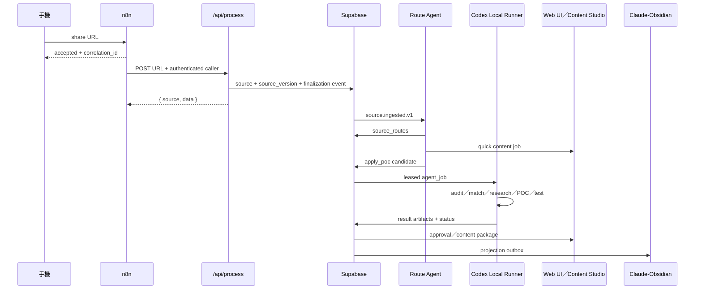

# `/api/process` Crawler Ingestion 與 Agent/Codex 下游管線

日期：2026-07-24
狀態：Stage A 本機程式與契約驗證完成；正式 DB migration／部署驗證與 Agent/Codex 目標流程尚未實作
相關主規格：`docs/knowledge_action_vault_master_plan.md`

## 0. 明日接手摘要

目前實際流程：

```text
n8n 送 URL
→ POST /api/process
→ Crawler／Parser
→ 同步 LLM 分類與摘要
→ 寫入 Supabase
→ 使用者有時間時再開 Web UI 人工整理
```

目標流程：

```text
n8n Capture Gateway
→ POST /api/process
→ Crawler／Parser／Source Version
→ Supabase finalization + source.ingested.v1
→ Route Agent
   ├─ quick_rewrite／translate_localize
   ├─ research_content
   └─ apply_poc
→ Codex Local Runner 掃描專案、匹配需求、建立 POC 與測試
→ Content Studio／Integration Approval／Knowledge Catalog
```

下一個實作入口是：在可回復環境套用 tenant-aware unique constraint 並驗證既有資料，接著設計 Stage B 的 source finalization／outbox migration。

## 1. 本文件的新邊界

`/api/process` 仍是穩定 ingestion API，但不再被視為整套產品的終點。

它負責：

- URL 與平台辨識。
- Crawler／Parser 擷取。
- Unified Post 正規化。
- 原始來源、媒體、留言與 capture metadata 入庫。
- 回傳既有 `{ source, data }` 契約。
- Source finalization 成功後，在可靠邊界發出 `source.ingested.v1`。

它不應長期負責：

- Project Auditor。
- 收藏與專案需求匹配。
- 深入研究與 POC。
- 正式專案修改。
- Content Studio 狀態管理。
- Vault filesystem 寫入。
- 等待 Codex 完成長時間 Agent Job。

目前同步 AI enrichment 暫時保留，直到新流程驗證完成；新 Agent pipeline 不依賴 legacy summary。

## 2. n8n 的 V2 職責

n8n 只保留：

1. 接收手機／外部分享 URL。
2. 驗證 URL、簽章與 caller。
3. 立即回覆 accepted＋correlation id。
4. 呼叫 `/api/process`。
5. 發送失敗、待批准或完成通知。

目前 Stage A credential 設定請見 `docs/n8n_capture_setup.md`：n8n 以 `x-api-key` 認證，body 只送 URL，後端由 `MEDIA_API_KEY_USER_ID` 決定來源 owner。

n8n 不再承擔：

- `POST /knowledge/jobs → Wait → GET status` 的長輪詢。
- Project scan。
- POC 與套件安裝。
- Agent 權限判斷。
- Vault managed section 合併邏輯。

原因：如果 source 已入庫，但 n8n 在建立 Knowledge Job 前中斷，資料會永遠留在「已收藏但未處理」。下游事件必須由 Backend／DB 與 source finalization 綁定。

## 3. Target Event Flow



## 4. Source Finalization

目前 `/api/process` 寫入 post、analysis、media 與 comments 的操作可能部分成功、部分失敗。V2 必須建立明確 finalization：

```text
capture_started
→ post_persisted
→ media_persisted／media_empty
→ comments_persisted／comments_empty
→ legacy_analysis_persisted／legacy_analysis_failed
→ source_finalized
→ source.ingested.v1
```

規則：

- core source 未保存，不得發出 `source.ingested.v1`。
- media／comments 為空與寫入失敗必須區分。
- legacy AI 失敗不需要重爬，但必須記錄真實失敗，不能寫成成功 mock。
- Source Event 必須包含 `source_id`、`source_version_id`、`user_id`、`correlation_id`、`capture_quality` 與 `pipeline_version`。
- 相同 idempotency key 重跑不得建立重複 Application Case 或 Content Job。

## 5. Route Agent 接點

Route Agent 讀取 `source.ingested.v1`，輸出多選 route：

```json
{
  "source_id": "...",
  "routes": [
    {
      "type": "quick_rewrite",
      "priority": 90,
      "reason": "適合即時發布"
    },
    {
      "type": "apply_poc",
      "priority": 75,
      "reason": "內容中的套件可能解決現有專案缺口"
    }
  ]
}
```

快速改寫不等待 Project Auditor 或 POC。

`apply_poc` 會：

1. 查詢 Project Map 與 Project Needs。
2. 產生具體 Application Case。
3. 建立 research／poc Agent Job。
4. 由 Codex Local Runner 在擁有專案 filesystem 的裝置執行。

## 6. Codex Local Runner 接點

Backend 不直接掛載使用者整顆硬碟。Codex Runner 必須在 Windows／Mac 本機執行：

```text
GET/lease agent job
→ 驗證 project allowlist 與 local rules
→ 讀取 repo
→ 執行 project audit／POC／test
→ POST progress／artifact／result
→ complete／awaiting_approval／failed
```

第一版 job types：

- `project_audit_full`
- `project_audit_incremental`
- `opportunity_match_verify`
- `research_candidate`
- `poc_execute`
- `integration_prepare`
- `content_transform`
- `vault_project`

需要的 Backend API 草案：

```text
POST /api/agent/jobs/:id/lease
POST /api/agent/jobs/:id/heartbeat
POST /api/agent/jobs/:id/progress
POST /api/agent/jobs/:id/complete
POST /api/agent/jobs/:id/fail
POST /api/agent/jobs/:id/request-approval
```

caller 必須是已登錄 Local Runner，不信任 body 內任意 device、project path 或 user id。

## 7. Project Auditor 排程

Project Auditor 必須：

- 專案第一次登錄時完整掃描。
- 重要 Commit 後增量掃描。
- 每週進行完整掃描。
- 新收藏與某專案高度相關時針對相關模組重掃。

輸出 `project_snapshot` 與 `project_need`，而不是直接改 [`docs/project/tasks.md`](project/tasks.md)。

每個 Project Need 必須有：

- 問題與影響。
- 檔案／模組／測試證據。
- severity、confidence。
- 建議驗證方式。
- 狀態與 last_checked_at。

## 8. `/api/process` 過渡策略

### Stage A：先保護現況

- [x] 補 caller authentication。
- [x] caller 身分映射 user，不信任 body `userId`。
- [x] 加 response `x-correlation-id`。
- [~] tenant-aware unique key：使用者已回報執行 [`database/deployments/add_unique_constraint.sql`](../database/deployments/add_unique_constraint.sql)，待 smoke test 獨立驗證。
- [~] partial write 與 silent success：寫入錯誤現會顯性失敗；跨表 atomic finalization 留待 Stage B。
- [x] 移除 Gemini fallback；MiniMax 回應改為只接受完整 JSON object。
- 保存成功、degraded、crawler failure fixtures。

### Stage B：新增可靠事件

- 不改 request body 與 `{ source, data }`。
- [x] 本機已完成 `finalize_collection_capture(...)` RPC 與 `collection_capture_outbox` deployment SQL：source、analysis、media、comments 與 `source.ingested.v1` outbox 在單一 transaction 完成。
- [~] 使用者已回報執行 [`database/deployments/stage_b_source_finalization.sql`](../database/deployments/stage_b_source_finalization.sql)；仍須依 [部署說明](stage_b_source_finalization_deployment.md) 做 `source_domains` 型別、RPC／idempotency smoke test。
- 新增 Route Agent dry-run，不觸發 Codex 寫入。

### Stage C：接入 Content 快車道

- `quick_rewrite`／`translate_localize` 先產生草稿。
- 不等待 Project Match。
- 保存來源與 content revision。

### Stage D：接入 Codex

- 建立 allowlisted project registry。
- Codex 先做 read-only Project Audit。
- 再開隔離 POC。
- 最後才開 opt-in `agent-dev`。

### Stage E：移出 legacy AI

- 新 pipeline 穩定且有回歸測試後，才將同步 LLM 從 `/api/process` request path 移出。
- Crawler ingestion 與下游 Agent failure 必須可獨立重跑。

## 9. P0 安全與資料完整性

Repo 靜態檢查已發現：

1. `/api/process` 的 caller authentication 與 server-side user mapping 已補上；部署環境需設定 `MEDIA_API_KEY_USER_ID` 給 n8n caller。
2. body `userId` 已停止使用；前端改以 Bearer JWT。
3. tenant-aware URL SQL 與 manual lookup 已更新，但遠端 constraint 尚未套用。
4. analysis／media／comments 的 Stage B atomic finalization/outbox 程式與 SQL 已準備；尚待 staging 套用與實際 DB 驗證。
5. Gemini 已完全移除；僅保留 MiniMax provider。
6. AI JSON 改為完整 object parse；待補各 job type 的正式 JSON schema。

正式實作前需檢查下游污染：

- 是否存在 source 有 post、但 analysis／media／comments 被刪除或缺漏。
- 是否存在相同 URL 被錯誤綁到其他 user。
- 是否有 Mock AI 結果被當成正常 analysis。
- 修復後重跑是否會造成重複 row 或覆寫人工資料。

## 10. 目前驗證指令

Windows PowerShell：

```powershell
node --test test/script/process_orchestrator_contract.test.js
node --check server/services/orchestrator.js
npm run build
```

macOS Terminal：

```bash
node --test test/script/process_orchestrator_contract.test.js
node --check server/services/orchestrator.js
npm run build
```

尚待新增：

- source finalization integration test。
- outbox idempotency test。
- Route Agent multi-route schema test。
- agent job lease／heartbeat／expiry test。
- Local Runner permission boundary test。
- quick content 不等待 POC 的流程測試。

---

## 2026-07-18 現況基線（歷史參考）

## 契約邊界

`POST /api/process` 同時供前端與 n8n 使用。本次只調整資料取得策略，不變更路由、request body 或成功 response 的 `{ source, data }` 結構。

目前 request body：

```json
{
  "url": "https://example.com/post",
  "userId": "optional-supabase-user-uuid"
}
```

## 現行擷取方式

| 平台 | 取得方式 | 是否使用 Chromium | 是否使用官方平台 API |
|---|---|---:|---:|
| Threads | Puppeteer DOM／meta 擷取；失敗時預留 Apify fallback | 是 | 否 |
| X / Twitter | Guest Token＋X 網站內部 GraphQL | 否 | 否 |
| Instagram / Facebook | 通用 Puppeteer DOM／meta 擷取 | 是 | 否 |
| Notion / GitHub / YouTube / 一般網站 | 通用 Puppeteer DOM／meta 擷取 | 是 | 否 |

Puppeteer 沒有設定 `PUPPETEER_EXECUTABLE_PATH` 時，使用套件管理的 Chrome for Testing；Linux 部署的 Threads crawler 會額外偵測 `/usr/bin/chromium` 或 `/usr/bin/chromium-browser`。2026-07-18 在目前 Windows 環境確認實際使用 Chrome for Testing `142.0.7444.175`，不是系統 Chromium。

目前 browser cache 位於 `C:\Users\bgkon\.cache\puppeteer`，不符合本專案的大型快取需放置 G 槽規則。移轉與清理列為 TODO，本次不直接搬動或刪除既有快取。

社群「發佈」端點仍會呼叫 Instagram、Threads、X 的發布 API；這與「取得貼文一律用爬蟲」是不同責任，本次未修改。

## `/api/process` 實際處理內容

目前它不只擷取與入庫，還會同步執行：

1. 平台辨識與 crawler 擷取。
2. 圖片下載並備份至 Supabase Storage。
3. `collection_posts` upsert。
4. Rule／LLM 主分類與 AI 摘要。
5. 寫入 analysis、media、comments。
6. 回傳 `{ source: "crawler", data }`。

AI enrichment 發生錯誤時會降級為錯誤摘要，避免整個 request 因 AI 失敗而中止；核心平台 crawler 失敗則回傳 HTTP 500，一般網址失敗則回傳 HTTP 202 degraded response。

## 最近 100 筆資料輪廓（2026-07-18 唯讀抽樣）

- 平台：Threads 62、X 34、Generic 3、GitHub 1。
- 分類：tool 38、ai 24、launch 9、productivity 8、opinion 8、other 8、design 3、market 2。
- 高頻方向：開發／程式 54、AI／模型 53、Agent Skills 51、自動化 29、設計 19、內容製作 18、投資 4。
- 100 筆皆已有 analysis；3 筆正文只有 URL，代表 X Article 正文擷取仍有缺口。

這批資料顯示收藏目的以「找到可安裝工具、複製工作流、快速做 POC、把技能產品化」為主，因此下一階段不應只生成摘要，而應把內容路由成 learn／implement／plan／strategy／content 等可執行結果。實作前仍需確認資料模型與自動執行邊界。

## 本機驗證

Windows PowerShell：

```powershell
node --test test/script/process_orchestrator_contract.test.js
node --check server/services/orchestrator.js
npm run build
```

macOS Terminal：

```bash
node --test test/script/process_orchestrator_contract.test.js
node --check server/services/orchestrator.js
npm run build
```
